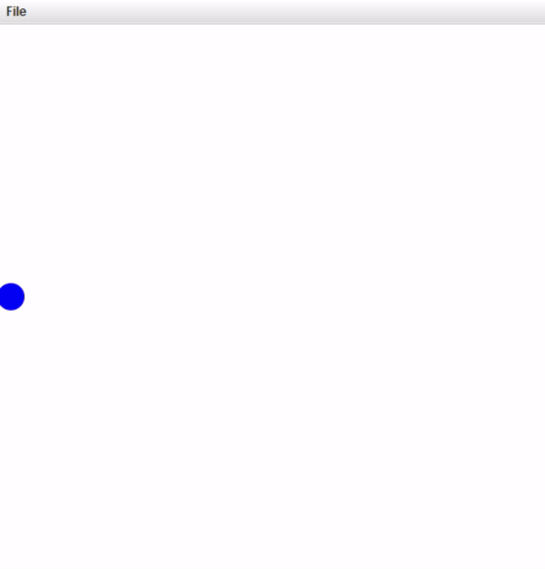
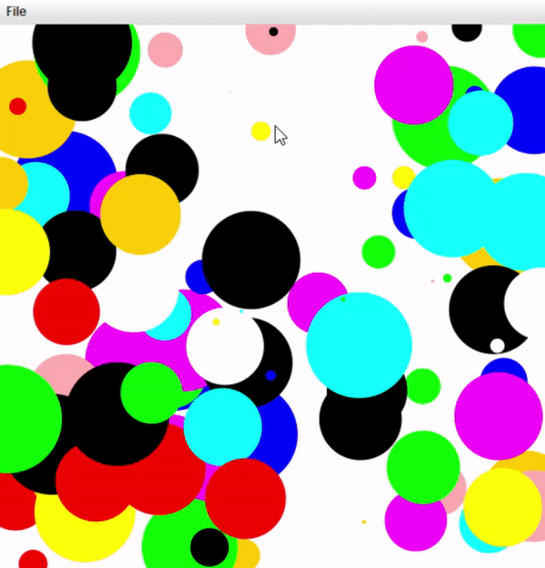

# interpreter for Layan

#### with layan you can draw on a 2d plane with a simple syntax.

## Examples

```c#
int canvasWidth = 100;

setPenSize(0.05);
setScale(0 , canvasWidth);
setColor("blue");

while(true) {
    for(int i = 0; i < canvasWidth; i = i + 1) {
        Point a(i, 50);
        a.draw();
        wait(10);
        clear();
    }
}
```

---



```c#
setPenSize(0.05);
setScale(0 , 100);
setColor("blue");

while(true){
    FilledCircle randomCircle(RAND * 100, RAND * 100, RAND * 10);
    randomCircle.draw();
    setRandomColor();
    wait(10);
}
```



---
```c#
int canvasWidth = 60;
setPenSize(0.005);
setScale(0 , canvasWidth);
while(true){
    setRandomColor();
    for(int i = 0; i < canvasWidth; i = i + 1) {
        Circle c(i, i, i);
        c.draw();
        wait(10);
    }

    setRandomColor();
    for(int i = canvasWidth - 1; i >= 0; i = i - 1) {
        Circle c(i, i, i);
        c.draw();
        wait(10);
    }
}
```


---

## Layan Grammars

```text
program: statements

statements:
declaration_stat: DATA_TYPE ID ('=' expression)? ((',' ID)('=' expression)?)? ';'
DATA_TYPE: 'int' | 'float' | 'bool' | 'string'
ID: (('a'..'z' | 'A'..'Z')+(NUMBER*))+
NUMBER: ('0'..'9')+('.' ('0'..'9')+)?
STRING: ' " ' (NAME | NUMBER)* ' " '
BOOLEAN: 'true' | 'false'

assignment_stat: (ID | resolution_object | array_access) '=' expression
resolution_object: ID ('.' ID)+

expression:
expr: and (('||') and)*
and: comp (('&&') and)*
comp: ar(('>' | '<' | '>=' | '<=' | '!=' | '==') or)
ar: term (('+'|'-') term)*
term: factor (('*', '/', '%') factor)*
factor: + | - | '(' expr ')' |  ('!'boolean_expr) | FLOAT| INT | STRING | 'true' | 'false' | ID
 | resolution_object | array_access

method_declaration: 'function' ID '(' parameters? ')' block
block: '{' function_statements '}'
parameters: declaration_stat (',' declaration_stat)*
function_statements: declaration_stat | if_statement | while_statement | for_statement
 | print_statement | return_statement

return_statement:
'return' ';'

class_declaration: 'class' ID (':' TYPE) block
block: '{'class_statements'}'
class_statements: declaration_stat | method_declaration

object_declaration:Type(ID) ID ( '(' args ')' )? ';'
parameters: declaration_stat (',' declaration_stat)*

resolution_object: ID ('.' (ID | function_call)) ';'

if_statement: 'if' '(' expression ')' block
('else' block')?
block: '{' function_statements '}'

while_statement: 'while' '(' boolean_expression ')' block
block: '{' function_statements '}'

for_statement: 'for' '(' variable_declaration ';' boolean_expression; statement')' block
stat:statements
statement: assignment_stat
block: '{' function_statements '}'

comments_stat: '/*' TEXT '*/'

operators:
<, >, <=, >=, !=, ==, !, &&, ||, %
function_call_stat: function_call ';'
function_call: ID '(' ((expression) ',')'* ')'

print_statement:
'print' '(' expression ')' ';'
```

## How to use layan
### Variables declaration.
#### There is a four data type in language (string, int, float, bool).

```c#
string name = "layan";
int year = 2019;
bool isComplete = false;
```

### Control flow :

```c#
if(isComplete){
  print("Layan is a great language");
 }else{
  print("Layan also is a great language");
 }
```

```c#
while(true){
  /* Draw a circle at random position in the canvas */
  Circle myCircle(RAND * WIDTH, RAND * WIDTH, RAND * 10);
  myCircle.draw();
}
```
```c#
for(int i = 0; i <= 10; i = i + 1){
  Square mySquare(50, 50, i, i);
  mySquare.draw();
  wait(50);
}
```

### Built-in drawable classes:
#### Layan has a built-in drawable class to draw a primitive object such as circle and square.

* Circle(x, y, radius);
* Square(x, y, halfWidth);
* Rectangle(x, y, halfWidth, halfHeight);
* Point(x, y);
* FilledCircle(x, y, radius);
* FilledSquare(x, y, halfWidth);
* FilledRectangle(x, y, halfWidth, halfHeight);
* Line(a, b, c, d);
* Text(x, y, value);

### use the draw function to draw the object.

### Examples:

```c#
Circle(20, 30, 5) myCircle;
myCircle.draw();
```

```c#
setPenSize(0.05);
setScale(0 , 100);
setColor("blue");

while(true){
    FilledCircle myCircle(RAND * 100, RAND * 100, RAND * 10);
    myCircle.draw();
    setRandomColor();
}
```

### Function declaration in Layan:

```c#
setPenSize(0.005);
setScale(0 , 100);
setColor("blue");

function CircleSquare(float xPosition, float yPosition, float halfWidth){
  Square square(xPosition, yPosition, halfWidth);
  square.draw();

  Circle circle(xPosition, yPosition, halfWidth);
  circle.draw();
}

CircleSquare(50, 50, 10);
```

